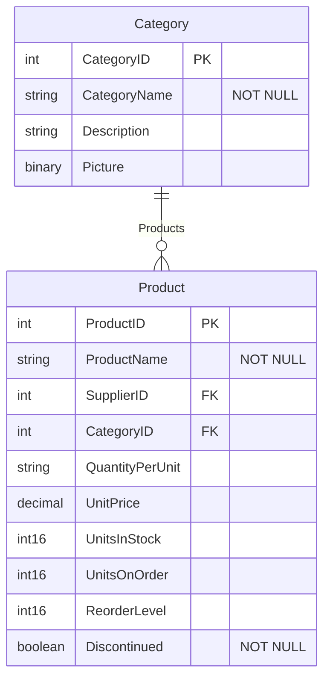

# OData Viewer

A comprehensive tool for visualizing and exploring OData metadata files with special support for SAP OData services. This application converts complex OData XML metadata into interactive Mermaid entity-relationship diagrams and provides detailed metadata exploration features.

## Features

- **Visualization**: Convert OData XML metadata into clear Mermaid ER diagrams
- **Support for Multiple OData Formats**:
  - Standard OData V2/V3/V4 formats
  - SAP-specific OData extensions
- **Entity Relationship Mapping**:
  - Accurately renders entity types with properties and data types
  - Shows relationships between entities with proper cardinality
  - Handles SAP-specific navigation properties and association patterns
- **Metadata Explorer**:
  - Browse entity types, properties, and relationships
  - Filter entities by tags (SAP specific)
  - View SAP-specific labels and annotations
- **Interactive Web Interface**:
  - User-friendly web application
  - Command-line option for direct conversion

## Usage

### Web Application

1. Install the required dependencies:
   ```bash
   pip install -r requirements.txt
   ```

2. Run the web application:
   ```bash
   streamlit run app.py
   ```

3. Upload your OData metadata XML file through the web interface

### Command Line

For direct conversion to Mermaid diagrams:

```bash
python odata_to_mermaid.py your_metadata.xml > diagram.mmd
```

## OData Support Details

### Standard OData Features

- Parses standard OData XML schemas (V2/V3/V4)
- Extracts entity types, properties, and their data types
- Identifies key properties (primary keys)
- Maps entity relationships through:
  - Association elements
  - NavigationProperty elements

### SAP OData Extensions

The tool has specialized handling for SAP OData metadata:

- **Multiple Schema Support**: Processes SAP files with multiple Schema elements
- **Namespace Handling**: Supports SAP-specific namespaces:
  - `sap`: http://www.successfactors.com/edm/sap
  - `sf`: http://www.successfactors.com/edm/sf
  - Alternative EDM namespaces: 2008/09 versions

- **SAP-Specific Annotations**:
  - Extracts `sap:label` annotations for readable entity and property names
  - Processes SAP CRUD capability flags: `sap:creatable`, `sap:updatable`, `sap:deletable`
  - Shows entity tags from `sap:tagcollection` and `sap:tag` elements

- **Flexible Parsing Strategies**:
  - Multiple approaches to find XML elements to handle SAP variants
  - Fallback mechanisms for different XML structures

## Requirements

- Python 3.6 or higher
- Dependencies:
  - streamlit>=1.28.0 (for web interface)
  - pandas>=2.0.0 (for data handling)

## Example Output

The tool generates Mermaid ER diagrams with entity properties and relationships:



The diagram shows entities with their properties and data types converted from OData XML format to a visual representation. Key properties are marked with PK (Primary Key) and foreign keys with FK.

## How It Works

1. **Parsing Phase**: The tool parses XML metadata using multiple namespace strategies
2. **Entity Extraction**: Identifies entities, properties, and keys
3. **Relationship Mapping**: Maps relationships between entities
4. **SAP Enhancement**: Processes SAP-specific annotations and tags
5. **Diagram Generation**: Generates a Mermaid ER diagram

## License

Apache License 2.0