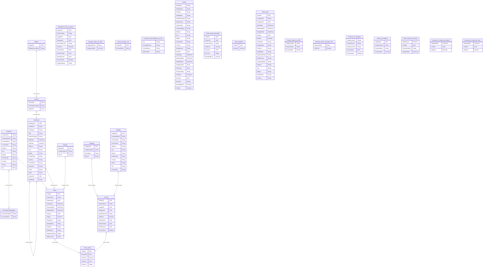

```mermaid
erDiagram
    Category {
        CategoryID Int32
        CategoryName String
        Description String
        Picture Binary
    }
    CustomerDemographic {
        CustomerTypeID String
        CustomerDesc String
    }
    Customer {
        CustomerID String
        CompanyName String
        ContactName String
        ContactTitle String
        Address String
        City String
        Region String
        PostalCode String
        Country String
        Phone String
        Fax String
    }
    Employee {
        EmployeeID Int32
        LastName String
        FirstName String
        Title String
        TitleOfCourtesy String
        BirthDate DateTime
        HireDate DateTime
        Address String
        City String
        Region String
        PostalCode String
        Country String
        HomePhone String
        Extension String
        Photo Binary
        Notes String
        ReportsTo Int32
        PhotoPath String
    }
    Order_Detail {
        OrderID Int32
        ProductID Int32
        UnitPrice Decimal
        Quantity Int16
        Discount Single
    }
    Order {
        OrderID Int32
        CustomerID String
        EmployeeID Int32
        OrderDate DateTime
        RequiredDate DateTime
        ShippedDate DateTime
        ShipVia Int32
        Freight Decimal
        ShipName String
        ShipAddress String
        ShipCity String
        ShipRegion String
        ShipPostalCode String
        ShipCountry String
    }
    Product {
        ProductID Int32
        ProductName String
        SupplierID Int32
        CategoryID Int32
        QuantityPerUnit String
        UnitPrice Decimal
        UnitsInStock Int16
        UnitsOnOrder Int16
        ReorderLevel Int16
        Discontinued Boolean
    }
    Region {
        RegionID Int32
        RegionDescription String
    }
    Shipper {
        ShipperID Int32
        CompanyName String
        Phone String
    }
    Supplier {
        SupplierID Int32
        CompanyName String
        ContactName String
        ContactTitle String
        Address String
        City String
        Region String
        PostalCode String
        Country String
        Phone String
        Fax String
        HomePage String
    }
    Territory {
        TerritoryID String
        TerritoryDescription String
        RegionID Int32
    }
    Alphabetical_list_of_product {
        ProductID Int32
        ProductName String
        SupplierID Int32
        CategoryID Int32
        QuantityPerUnit String
        UnitPrice Decimal
        UnitsInStock Int16
        UnitsOnOrder Int16
        ReorderLevel Int16
        Discontinued Boolean
        CategoryName String
    }
    Category_Sales_for_1997 {
        CategoryName String
        CategorySales Decimal
    }
    Current_Product_List {
        ProductID Int32
        ProductName String
    }
    Customer_and_Suppliers_by_City {
        City String
        CompanyName String
        ContactName String
        Relationship String
    }
    Invoice {
        ShipName String
        ShipAddress String
        ShipCity String
        ShipRegion String
        ShipPostalCode String
        ShipCountry String
        CustomerID String
        CustomerName String
        Address String
        City String
        Region String
        PostalCode String
        Country String
        Salesperson String
        OrderID Int32
        OrderDate DateTime
        RequiredDate DateTime
        ShippedDate DateTime
        ShipperName String
        ProductID Int32
        ProductName String
        UnitPrice Decimal
        Quantity Int16
        Discount Single
        ExtendedPrice Decimal
        Freight Decimal
    }
    Order_Details_Extended {
        OrderID Int32
        ProductID Int32
        ProductName String
        UnitPrice Decimal
        Quantity Int16
        Discount Single
        ExtendedPrice Decimal
    }
    Order_Subtotal {
        OrderID Int32
        Subtotal Decimal
    }
    Orders_Qry {
        OrderID Int32
        CustomerID String
        EmployeeID Int32
        OrderDate DateTime
        RequiredDate DateTime
        ShippedDate DateTime
        ShipVia Int32
        Freight Decimal
        ShipName String
        ShipAddress String
        ShipCity String
        ShipRegion String
        ShipPostalCode String
        ShipCountry String
        CompanyName String
        Address String
        City String
        Region String
        PostalCode String
        Country String
    }
    Product_Sales_for_1997 {
        CategoryName String
        ProductName String
        ProductSales Decimal
    }
    Products_Above_Average_Price {
        ProductName String
        UnitPrice Decimal
    }
    Products_by_Category {
        CategoryName String
        ProductName String
        QuantityPerUnit String
        UnitsInStock Int16
        Discontinued Boolean
    }
    Sales_by_Category {
        CategoryID Int32
        CategoryName String
        ProductName String
        ProductSales Decimal
    }
    Sales_Totals_by_Amount {
        SaleAmount Decimal
        OrderID Int32
        CompanyName String
        ShippedDate DateTime
    }
    Summary_of_Sales_by_Quarter {
        ShippedDate DateTime
        OrderID Int32
        Subtotal Decimal
    }
    Summary_of_Sales_by_Year {
        ShippedDate DateTime
        OrderID Int32
        Subtotal Decimal
    }
    Category |o--o| Product : "many-to-many"
    Customer |o--o| CustomerDemographic : "many-to-many"
    Customer |o--o| Order : "many-to-many"
    Employee |o--o| Employee : "many-to-many"
    Employee |o--o| Order : "many-to-many"
    Territory |o--o| Employee : "many-to-many"
    Order |o--o| Order_Detail : "one-to-many"
    Product |o--o| Order_Detail : "one-to-many"
    Shipper |o--o| Order : "many-to-many"
    Supplier |o--o| Product : "many-to-many"
    Region |o--o| Territory : "one-to-many"
```